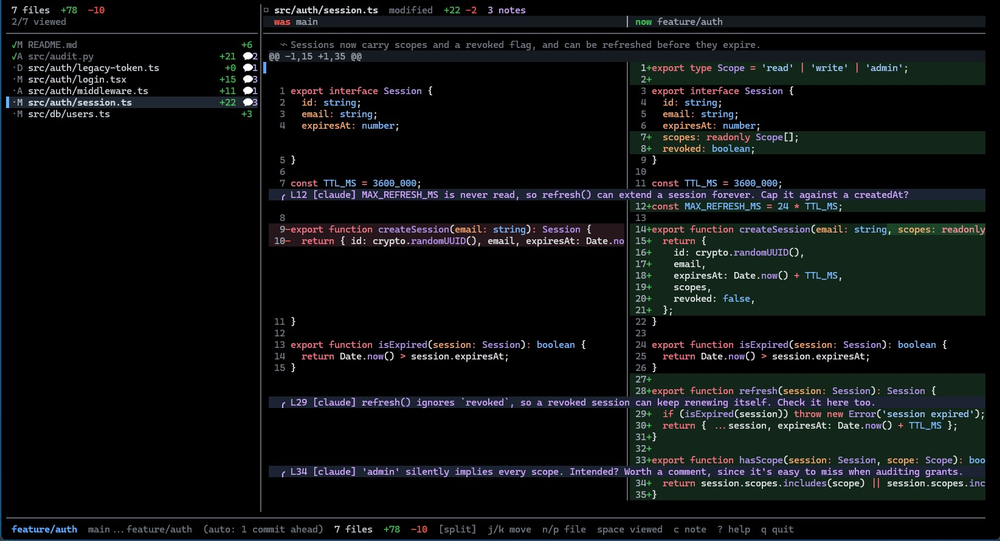

# prview

**A GitHub-style diff reviewer for your terminal.** Split-pane view, syntax
colours that match GitHub exactly, and unlike a pager, it remembers your
review — which files you've looked at, and the notes you left on specific
lines.



## ✨ Why prview

- 🎨 **GitHub-accurate syntax highlighting**, split or unified layout
- 👀 **Viewed-state tracking** — like GitHub's checkbox, persisted per range
- 💬 **Line notes**, exported as Markdown the moment you quit
- 🔀 **Auto-detects the PR base branch** — `--pr` just works, and you can
  review a colleague's branch with no checkout
- 🤖 **Optional AI summaries** (`--explain`) — off by default, your call every time
- 🧩 **A Claude Code skill included** — an agent can leave its own review
  notes on the code it just wrote

## Install

```sh
npm install -g prview
```

Or try it without installing: `npx prview`.

Node 20+. Nothing else to install.

## Use

```sh
prview                     # working tree vs HEAD — what am I about to commit
prview --pr                # PR view, base branch detected for you
prview --pr feat/theirs    # review someone else's branch — no checkout needed
prview develop             # ...or name the base yourself
```

A bare ref is treated as a **base branch**, so `prview develop` shows the
three-dot diff GitHub shows on a pull request: your commits only, not the
commits `develop` gained while you were working.

📖 See **[every flag](docs/flags.md)** for staged diffs, revision ranges,
context/layout options, and everything else.

## Keys

| | |
|---|---|
| `j` `k` `↓` `↑` | move a line |
| `ctrl-d` `ctrl-u` | half page |
| `g` `G` | top / bottom of file |
| `}` `{` | next / previous hunk |
| `h` `l` `←` `→` | scroll code sideways; stops auto-follow for this file |
| `0` | reset sideways scroll and resume auto-follow |
| `n` `p` (or `J` `K`) | next / previous file |
| `Tab` `shift-Tab` | next / previous **unviewed** file |
| `space` | toggle viewed on this file |
| `a` / `A` | mark all viewed / clear all (both ask first) |
| `c` | write a note on the cursor line |
| `d` | delete the note on the cursor line |
| `s` | split ⇄ unified |
| `o` | quit and open `$EDITOR` at this line |
| `w` | write notes to `prview-notes.md` |
| `r` | re-read the diff from git |
| `esc` | cancel a running explain |
| `?` `q` | help / quit |

Notes are printed to stdout as Markdown when you quit, ready to paste into a
review.

## Generated explanations

`--explain` sends the diff to the `claude` CLI (Haiku 4.5 by default) in a few
batched requests and shows a one-line summary above each file. It is **off by
default**: pass `--explain` per run, or set `PRVIEW_EXPLAIN=1`. Summaries are
cached per file version, so re-opening a review sends nothing.

📖 See [how `--explain` works](docs/explain.md) for batching, what is skipped, and the limits.

## Review state

Viewed marks, notes and summaries live in `.git/prview/reviews.json`. That is
inside the git dir, so it never shows up in `git status`. Each range you
review keeps its own state, and a viewed mark clears itself when the file
changes. `prview <range> --reset summaries|viewed|notes|all` clears one kind.

## Learn more

| | |
|---|---|
| 📖 [Every flag](docs/flags.md) | the full CLI reference |
| 🤖 [How `--explain` works](docs/explain.md) | the `claude` CLI call, batching, caching and limits |
| 🧩 [The annotate-for-review skill](docs/annotate-for-review.md) | let a Claude Code session leave notes on its own changes |

## Development

```sh
npm install
npm run build
npm link                              # puts your checkout's `prview` on your PATH
npm test                              # unit tests for the parser, pairing, runs
npm run typecheck
npm run dev                           # esbuild watch
npm run build -- --preview            # also build the headless renderer
node dist/preview.js <repo> [spec] --cols 150 --rows 30 --keys "n,n,j,space,c"
```

`dist/preview.js` boots the real UI against a real repo with a fake TTY and
prints the final frame. It is how the layout gets checked without a terminal,
and how key handling gets tested.

## Known limits

- Code lines are sliced by character when scrolling sideways, so CJK or emoji
  inside source can shift the split by a cell. Tabs are expanded on read
  (`--tab-width`).
- No filtering of generated files yet. A 6,000-line lockfile diff renders in
  about two seconds; you probably want to mark it viewed and move on.
- Notes are local and personal. Pushing them to a PR as review comments would
  need `gh` and is not wired up.
- A range key includes the head commit, so amending, rebasing or adding a
  commit starts a fresh review and leaves the old one behind. `--prune` clears
  those out, but re-run `--annotate` (or the skill) after rewriting history to
  put your notes on the new review.

## License

[MIT](LICENSE)
